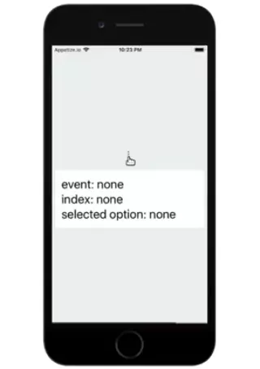
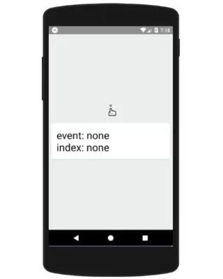

# react-native-default-menu

[](https://www.npmjs.com/package/react-native-default-menu) [](https://www.npmjs.com/package/react-native-default-menu) [](https://travis-ci.org/souvik-ghosh/react-native-default-menu)

Menu component for showing default OS menus. Uses ActionSheetIOS for IOS and UIManager for Android

## Installation

`npm i react-native-default-menu` 

or

`yarn add react-native-default-menu`

## Usage

```js
...
import Menu from 'react-native-default-menu';
...
const options = ['Edit', 'Remove'];
...
onPopupEvent = (eventName, index) => {
  if (eventName === 'itemSelected') eventName = options[index];
  console.log(eventName, index)
};
...
render() {
  return(
    <View>
      <Menu options={options} onPress={this.onPopupEvent} />
    </View>
   )
}
```
## Demo

 

## Complete example

```js
import React {Component} from 'react';
import { Text, View, StyleSheet } from 'react-native';
import Menu from 'react-native-default-menu';

const options = ['Edit', 'Remove'];

export default class App extends Component {
  constructor(props) {
    super(props);
    this.state = {
      eventName: 'none',
      index: 'none',
    };
  }

  onPopupEvent = (eventName, index) => {
    if (eventName === 'itemSelected') eventName = options[index];
    this.setState({ eventName, index });
  };
  
  render() {
    return (
      <View style={styles.container}>
        <View>
          <Menu options={options} onPress={this.onPopupEvent} />
        </View>
        <View style={{ padding: 15 }}>
          <Text style={styles.text}>{`event: ${this.state.eventName}`}</Text>
          <Text style={styles.text}> {`index: ${this.state.index}`}</Text>
        </View>
      </View>
    );
  }
}

const styles = StyleSheet.create({
  container: {
    flex: 1,
    justifyContent: 'center',
    backgroundColor: '#ecf0f1',
    padding: 8,
  },
});

```


